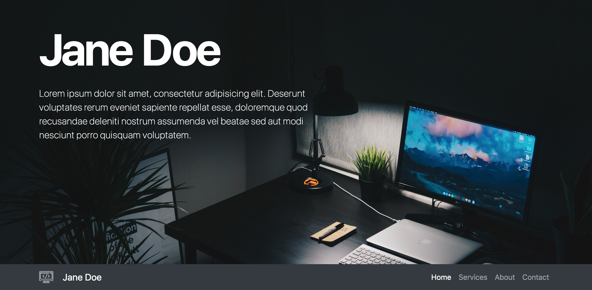
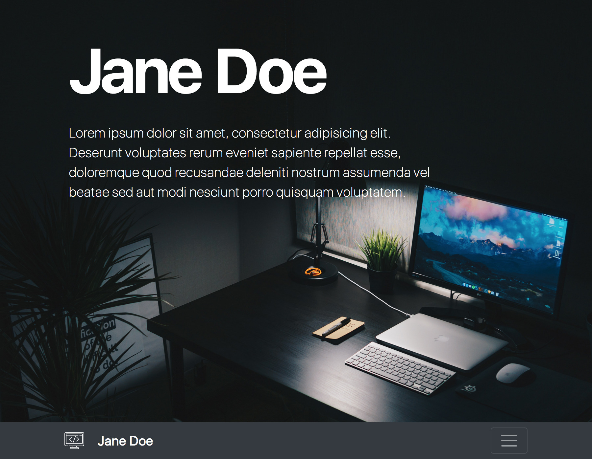
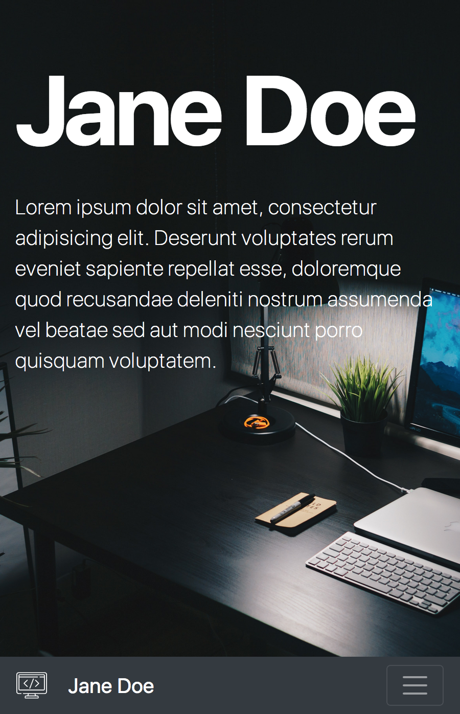

# Big Picture Portfolio

Let's create a portfolio website with Bootstrap! The only custom CSS you might need is for the big image.

Take a look at the examples:

Desktop:



Tablet:



Mobile:



## Extra:

- What else can you add to optimize this site for seach engines?

I have made sure that the page has a title, author's name and description inside the `head` element. Inside the document body, there is an `H1` heading.

- The image included in the `images` folder is quite big - how can you improve this?

I used the ImageMagick&copy; tool to resize the image. The following command did it:

```bash
magick mogrify -resize 50% ./images/nikita-kachanovsky-OVbeSXRk_9E-unsplash.jpg
```

(For devices with a screen width over 2651px I would use a smaller percentage...)

- Can you deploy this site to Github Pages? If you do, add the link to repo description.

[Link to GitHub pages](https://olhanotolga.github.io/jane-doe-bootstrap-portfolio/)

I created a new repository, pushed the code to it, added a new remote, and pushed the code to the gh-pages branch on a new remote.

## Credits:

Icons made by <a href="https://www.flaticon.com/authors/freepik" title="Freepik">Freepik</a> from <a href="https://www.flaticon.com/" title="Flaticon"> www.flaticon.com</a>
